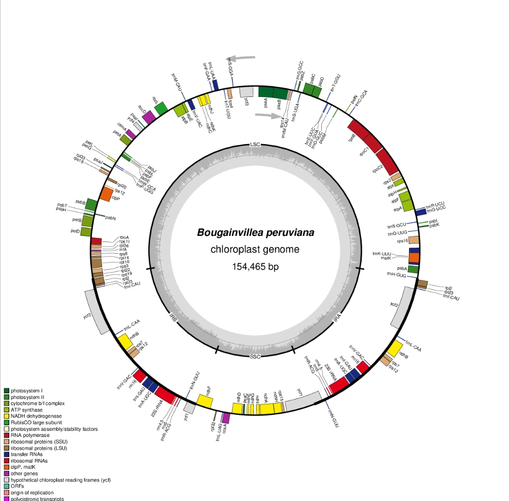

# Visualize Plastid Genome Structure

**Name:** Gedden D. Estrevillo

**Course / Section:** Cell and Molecular Biology, Section A

| Item | Details |
|---|---|
| Species | *Bougainvillea peruviana* |
| Accession | NC_049005.1 (RefSeq) |
| Genome length | 154,465 bp |
| Genome file source | NCBI Nucleotide (GenBank format) |
| Software | OGDRAW (OrganellarGenomeDRAW) |

## OGDRAW settings
Standard map, circular, plastid, automatic inverted repeat detection. I turned on the GC content graph, transcription direction, the full legend and asterisks for genes with introns. Output was PNG.

## Plastid genome map

## Main structural features
The genome is circular and has the usual four parts: LSC (85,563 bp), IRA (25,426 bp), SSC (18,050 bp) and IRB (25,426 bp). Genes in the inverted repeats, like the rRNA genes, rpl2, rpl23 and ycf2, show up twice on the map. The GC graph is not flat, and the inverted repeats look a bit higher in GC.

## Answers
See [answers/Lab_plastid_genome_answers.md](answers/Lab_plastid_genome_answers.md).

## References
- [OGDRAW](https://chlorobox.mpimp-golm.mpg.de/OGDraw.html)
- Greiner S, Lehwark P, Bock R. 2019. OrganellarGenomeDRAW (OGDRAW) version 1.3.1. Nucleic Acids Research 47: W59-W64.
- [NCBI RefSeq NC_049005.1](https://www.ncbi.nlm.nih.gov/nuccore/NC_049005.1)
